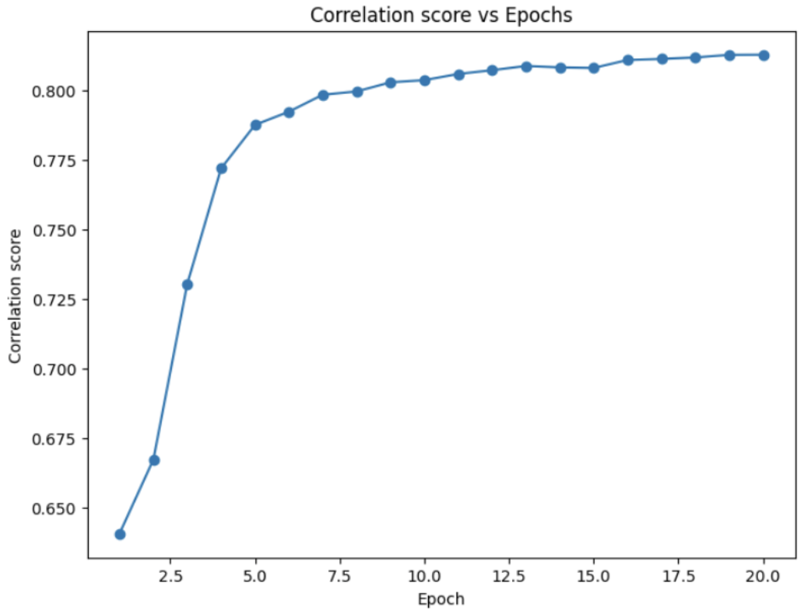
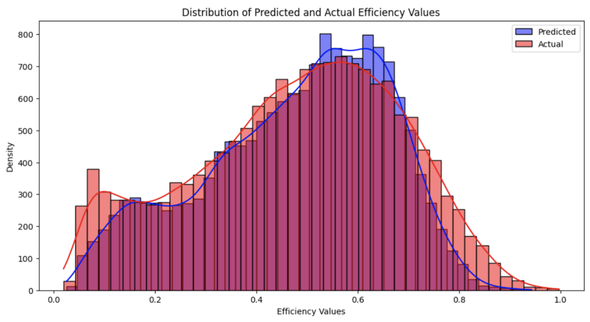

# sgRNA_OnTargetEfficiency_HAMP


This repository contains code for comparing various machine learning models, including Multi-Layer Perceptron (MLP), DNABert+MLP, Bidirectional Long Short-Term Memory (BiLSTM), and Transformer, to predict the on-target efficiency of single-guide RNA (sgRNA) sequences for the CRISPR-Cas9 system. The models take as input sequences of the sgRNA (including the gRNA and PAM sequences) and output the predicted efficiency score.

Given the nature of our dataset, which consists of relatively short sequences (sgRNA sequences of length 23) and a regression task (predicting efficiency scores), the bidirectional LSTM (BiLSTM) architecture gave us the best results with a Spearman correlation score of 0.813 amongst all the models.

# sgRNA Efficiency Prediction using BiLSTM

## Requirements

- Python 3.6+
- PyTorch
- Pandas
- NumPy
- Matplotlib
- Seaborn
- Scikit-learn

## Dataset

The dataset used in this code is from the paper "Daqi_ang_nature_2019_.csv" by Ang et al. (2019). The dataset contains sgRNA sequences and their corresponding SpCas9-HF1 efficiency scores. The code assumes that the dataset file is located in the `/Data` directory.

## Usage

1. Clone the repository or copy the code into a Python file.
2. Make sure you have the required dependencies installed.
3. Run the Python script. It will train the BiLSTM model for a specified number of epochs (default is 20) and print the training loss, validation loss, and validation Spearman's correlation coefficient for each epoch.

```python
python3 bilstm.py
```

4. After training, the script will generate the following plots and save them as PNG files:
- loss.png: A plot of training and validation losses over epochs.

- cor.png: A plot of validation Spearman's correlation coefficient over epochs.

- Distribution.png: A histogram plot showing the distribution of predicted and actual efficiency values for the validation set.


## Customization
You can customize the model architecture, hyperparameters, and other settings by modifying the code in the appropriate sections. For example, you can change the sequence length, batch size, hidden layer size, number of layers, dropout rate, and learning rate by modifying the corresponding variables and function parameters.

## Contributing
Contributions to improve the code or add new features are welcome! Please feel free to submit a pull request or open an issue for any suggestions or bug reports.

## References
Ang, D., Ang, Y. Y., Lau, W. Y., Lau, J. K., Tan, Y. H., Zhang, C., ... & Leong, C. W. (2019). Machine learning-guided massively parallel crRNA identification for genome editing. Nature Methods, 16(10), 949-952.